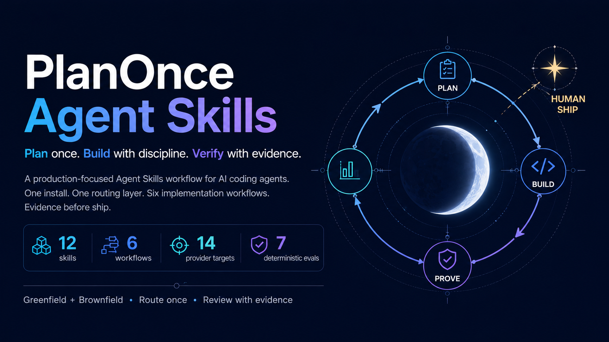
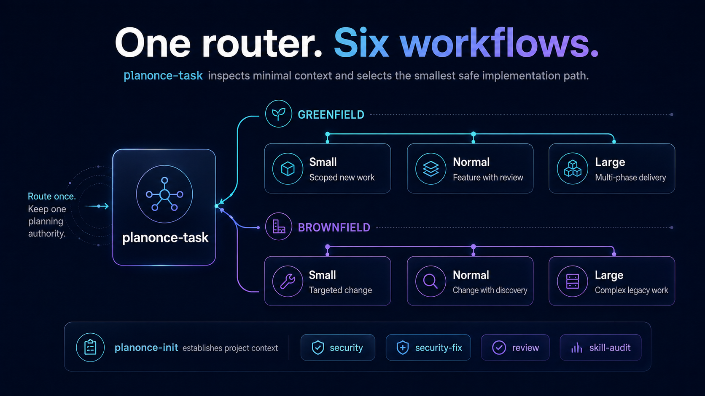
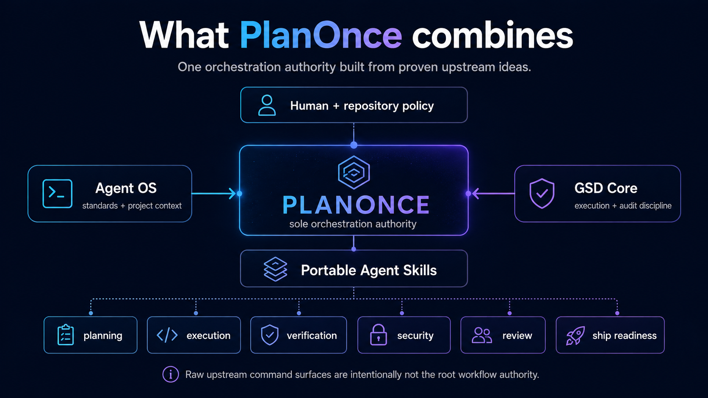
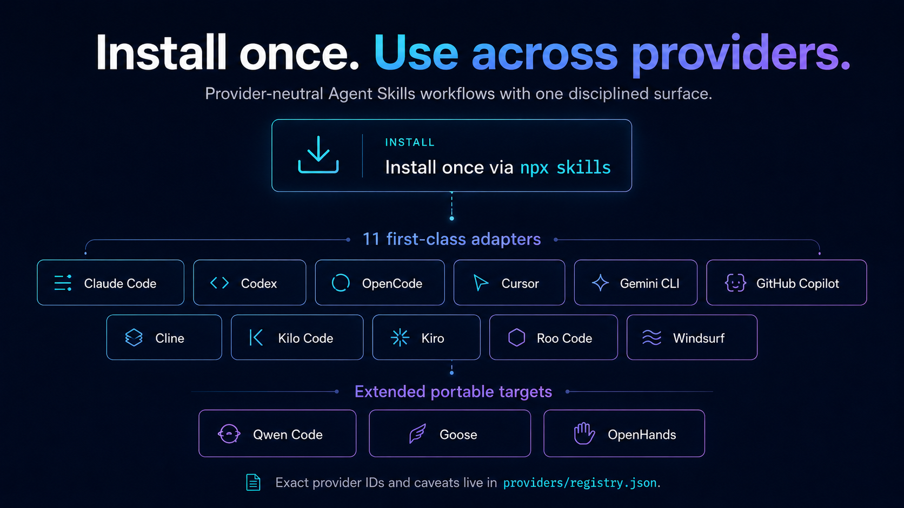
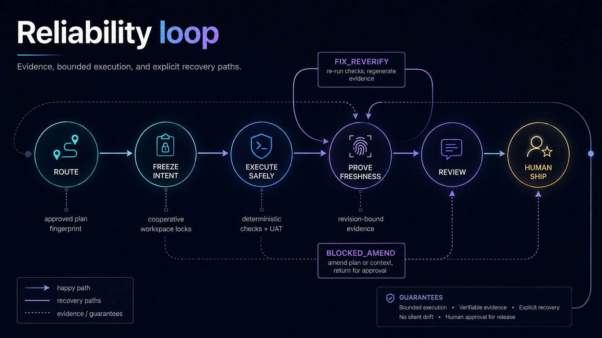

<div align="center">


# PlanOnce Agent Skills

### Plan once. Build with discipline. Verify with evidence.

[](RELEASE_MANIFEST.json)
[](LICENSE)
[](#what-planonce-combines)
[-059669?style=flat-square)](providers/registry.json)
[](#vendored-upstream-engines)
[](#validate-the-pack)
[](website/)

**PlanOnce** is an **open-source framework** with **pinned upstream** (Agent OS v3.0.0 + GSD 1.12.0) for building high-quality software with any AI coding agent.
It is a **single-install** production engineering control layer that turns planning, execution, verification,
security review, and ship readiness into **one durable workflow contract**.

It gives Claude Code, Codex, OpenCode, Cursor, Gemini CLI, GitHub Copilot, Cline, Kilo Code, Kiro, Roo Code,
Windsurf, Qwen Code, Goose, OpenHands, and other Agent Skills–capable runtimes the same disciplined
Greenfield/Brownfield workflows — **without making developers install multiple methodology frameworks**.

<a href="docs/getting-started/"></a>
&nbsp;<a href="docs/getting-started/"><b>Quickstart →</b></a>
&nbsp;·&nbsp;
<a href="#install-once">Install</a>
&nbsp;·&nbsp;
<a href="docs/">Docs</a>
&nbsp;·&nbsp;
<a href="providers/registry.json">Providers</a>
&nbsp;·&nbsp;
<a href="website/">Website</a>
&nbsp;·&nbsp;
<a href="https://github.com/tph-kds/PlanOnce/stargazers">⭐ Star us</a>

---



</div>

---

## 🎯 Why PlanOnce

AI coding agents generate changes fast. **Production engineering still needs**:

- **Accepted intent** that survives across prompts.
- **One planning authority** — execution decomposition is not a second design pass.
- **Fresh evidence** that is bound to revision and the approved plan digest.
- **Explicit failure routing** — `FIX_REVERIFY`, `BLOCKED_AMEND`, `DIAGNOSE`.
- **Human gates** at every one-way decision.
- **Provider-neutral delivery** across the coding agents your team already uses.

PlanOnce turns these promises into one durable workflow contract that any AI coding agent can run.

---

## 🚀 Install once

Primary cross-provider install:

```bash
npx skills add tph-kds/PlanOnce --all
```

For project-local copies that can be committed:

```bash
npx skills add tph-kds/PlanOnce --all --copy -y
```

Or target supported agents explicitly using the exact Skills CLI IDs:

```bash
npx skills add tph-kds/PlanOnce --skill '*' \
  -a claude-code -a codex -a opencode -a kilo -a kiro-cli -a roo \
  -a cursor -a gemini-cli -a github-copilot -a cline -a windsurf -y
```

Additional tracked portable targets:

```bash
npx skills add tph-kds/PlanOnce --skill '*' -a qwen-code -a goose -a openhands -y
```

> Windows PowerShell: use `"*"` or avoid the wildcard via `npx skills add tph-kds/PlanOnce --all`. If `npx` is blocked by `Restricted` execution policy, run `npx.cmd ...` or `npx --yes skills@latest add ... --all`. See `docs/INSTALLATION.md#troubleshooting-end-user-install`.

> Important: Kiro's Skills CLI ID is `kiro-cli`, not `kiro`. Current Kilo docs prefer `.kilo/skills/` and
> also load `.agents/skills/`, while the current Skills CLI source still contains a legacy
> `.kilocode/skills/` mapping for `kilo`; PlanOnce documents and tests this discrepancy rather than
> silently assuming the paths are identical.

---

## 🎯 Start with one task router

For most work, start with the route-only skill:

```text
Use planonce-task to implement <change>.
```

`planonce-task` inspects only enough context to select the smallest safe Greenfield/Brownfield workflow,
explains the decision, and exits. It **does not plan** the feature, so PlanOnce still has exactly one
implementation planning authority.

Repository-level users can also inspect deterministic routing with `python scripts/route_task.py`; targeted
skill installs carry the same rules inside the skill.

---

## 🛠️ The six implementation workflows

<table>
  <thead>
    <tr>
      <th>Project</th>
      <th align="center">Small</th>
      <th align="center">Normal</th>
      <th align="center">Large</th>
    </tr>
  </thead>
  <tbody>
    <tr>
      <td><b>Greenfield</b></td>
      <td align="center"><code>planonce-green-small</code></td>
      <td align="center"><code>planonce-green-normal</code></td>
      <td align="center"><code>planonce-green-large</code></td>
    </tr>
    <tr>
      <td><b>Brownfield</b></td>
      <td align="center"><code>planonce-brown-small</code></td>
      <td align="center"><code>planonce-brown-normal</code></td>
      <td align="center"><code>planonce-brown-large</code></td>
    </tr>
  </tbody>
</table>

Initialize durable project context once with `planonce-init`. Use `planonce-task` when you want PlanOnce to
choose the implementation workflow for you.

<div align="center">
  
  <br /><sub><i>Six routes. One vocabulary. One planning authority.</i></sub>
</div>

<br />

### Cross-cutting production skills

| Skill | Purpose | Default mutation |
|---|---|---|
| `planonce-security` | Diff/codebase security scan + verified findings + fix recommendations | Read-only source code |
| `planonce-security-fix` | Fix one explicit security Finding ID and prove closure | Bounded source edit |
| `planonce-review` | Code + production-readiness review, ship decision, backlog separation | Read-only source code |
| `planonce-skill-audit` | Pre-install/update Agent Skill/plugin supply-chain audit | Read-only candidate |

`planonce-task` selects one canonical implementation workflow; Normal/Large route through `planonce-review`;
security-sensitive changes route through `planonce-security`. Large workflows require **both** before ship.

If the client exposes skills as slash commands:

```text
/planonce-brown-normal
```

If it does not:

```text
Use planonce-brown-normal to implement refresh-token rotation.
```

The skill name is canonical; slash syntax is only a presentation convenience and varies by runtime.

---

## ⚡ What PlanOnce combines

- **Agent OS v3.0.0:** discover/index standards, selectively inject relevant standards, establish product
  context, and shape stronger specs/plans.
- **GSD Core v1.12.0 (`core,audit` source):** current-state discovery, bounded execution waves,
  fresh-context separation, verification, audit and review discipline.
- **PlanOnce-specific:** one orchestration/planning authority, route-only automatic workflow selection,
  Greenfield/Brownfield routing, versioned artifacts, approved-plan fingerprints, revision-bound evidence,
  cooperative workspace locks, explicit `FIX_REVERIFY` vs `BLOCKED_AMEND` recovery, provider fallbacks,
  human gates, security/readiness gates, and executable evals.

The raw Agent OS/GSD command surfaces are intentionally **not active at repository root**. This prevents
duplicate `/gsd:*` / Agent OS entry points and provider-specific hooks from competing with PlanOnce.
See [`docs/RUNTIME_ARCHITECTURE.md`](docs/RUNTIME_ARCHITECTURE.md).

<div align="center">
  
  <br /><sub><i>One authority. Supporting engines underneath.</i></sub>
</div>

<div align="center">
  
  <br /><sub><i>14 provider targets, 11 first-class adapters, local compatibility assets.</i></sub>
</div>

<br />

## 🔄 The core workflow

<div align="center">
  
  <br /><sub><i>Route. Freeze. Execute. Prove. Recover. Review.</i></sub>
</div>

<div align="center">
  
  <br /><sub><i>Six routes. One vocabulary. One planning authority.</i></sub>
</div>

<br />

```text
Repository evidence + selected standards
                ↓
          PLAN ONCE
                ↓
          Human approval
                ↓
    bounded phase / wave execution
                ↓
      deterministic checks + UAT
                ↓
       requirement/diff audit
                ↓
           Human ship
```

---

## 🔒 Security and review are evidence gates

PlanOnce does not treat an LLM self-review as proof. Security combines repository-native deterministic
checks with threat-model-guided semantic review and independent verification of high-impact findings.
Code review separates introduced blockers from pre-existing Brownfield backlog and returns `READY`,
`READY_WITH_BACKLOG`, `NOT_READY`, or `BLOCKED`. Missing checks remain visible as `NOT_RUN` / `BLOCKED`.

External scanners are optional and never auto-installed. See [`docs/SECURITY_TOOLING.md`](docs/SECURITY_TOOLING.md).

---

## 🌐 Provider-neutral by design

PlanOnce specifies semantic capabilities — **Ask human**, **Read/write**, **Run command**, optional
**Fresh worker**, optional **Isolated workspace** — and maps them in `providers/`. If subagents are
unavailable, the workflow falls back to sequential execution with compact handoffs; verification and
human gates remain unchanged.

First-class guidance is included for **Claude Code, Codex, OpenCode, Cursor, Gemini CLI, GitHub Copilot,
Cline, Kilo Code, Kiro, Roo Code, and Windsurf**, plus a generic adapter used by extended targets such as
**Qwen Code, Goose, and OpenHands**.

<br />

## 📦 Provider installation registry

`providers/registry.json` pins the exact `npx skills --agent` IDs and current project/global paths that
PlanOnce documents. This prevents display-name drift such as accidentally using `kiro` instead of the
correct `kiro-cli`.

Generate an exact command without installing anything:

```bash
python scripts/install_matrix.py --list
python scripts/install_matrix.py --providers opencode,kilo,kiro-cli,roo
```

---

## 🔧 Vendored upstream engines

`upstream.lock.json` pins:

- Agent OS `v3.0.0` / `809fb4e`
- GSD Core `v1.12.0` / `ceed559`

`upstream/agent-os/SOURCE/` is an exact `git archive` of Agent OS v3.0.0. `upstream/gsd-core/runtime/`
preserves the uploaded GSD v1.12.0 runtime, and `upstream/gsd-core/profiles/claude-core-audit/` preserves
the installed Claude `core,audit` surface as inert auditable source. Machine-local settings, installer
state, and active root hooks are excluded. Upstreams never auto-update at runtime; changing a pin is a
reviewed PlanOnce release event. See [`docs/RUNTIME_ARCHITECTURE.md`](docs/RUNTIME_ARCHITECTURE.md) and
[`docs/WORKFLOW_ENGINE.md`](docs/WORKFLOW_ENGINE.md).

---

## 📁 Project state

```text
.planonce/
├── PROJECT.md
├── POLICY.yml
├── standards/
│   └── index.yml
└── work/<change>/
    ├── CONTEXT.md
    ├── DESIGN.md   # Large only
    ├── PLAN.md     # Normal/Large; single authority
    ├── STATE.md
    └── VERIFY.md
```

Statuses: `NOT_STARTED` · `IN_PROGRESS` · `IMPLEMENTED_NOT_VERIFIED` · `BLOCKED` · `VERIFIED` · `COMPLETE`.

`COMPLETE` requires revision-bound fresh verification evidence **and** the final human ship gate.
Normal/Large additionally require the current `PLAN.md` digest to match the human-approved digest
recorded in `STATE.md`.

---

## ✅ Validate the pack

```bash
python scripts/validate.py
python -m unittest discover -s tests -v
python scripts/verify_upstreams.py
python scripts/audit_skill_pack.py
python scripts/run_evals.py
python scripts/release_gate.py
```

See [`docs/WORKFLOW_MATRIX.md`](docs/WORKFLOW_MATRIX.md), [`docs/POLICY.md`](docs/POLICY.md) for
routing/policy, and [`docs/EVIDENCE_CONTRACT.md`](docs/EVIDENCE_CONTRACT.md) for the Definition of
Verified.

---

## 🛡️ Reliability layer

PlanOnce v1.0 makes key workflow promises machine-checkable without adding a daemon or database:

- `planonce.* /v1` artifact schemas keep Markdown human-readable while giving tools stable metadata;
- approved Normal/Large plans are fingerprinted with deterministic SHA-256;
- verification is bound to Git revision + relevant working-tree digest and becomes stale after code
  changes;
- failures route to `FIX_REVERIFY`, `BLOCKED_AMEND`, or `DIAGNOSE` instead of reflexive re-planning;
- `.planonce/locks/` provides optional atomic cooperative file-scope locks for parallel workers;
- deterministic runtime evals run in release gates, while provider-neutral agent eval adapters let
  maintainers compare real coding agents.

See [`docs/ARTIFACT_SCHEMA.md`](docs/ARTIFACT_SCHEMA.md), [`docs/WORKSPACE_SAFETY.md`](docs/WORKSPACE_SAFETY.md),
and [`docs/EVAL_HARNESS.md`](docs/EVAL_HARNESS.md).

---

## 🤝 Contributing

We welcome PRs that keep PlanOnce small, testable, and provider-neutral. Please read
[`CONTRIBUTING.md`](CONTRIBUTING.md) before submitting:

1. Add or change behavior through a failing repo-contract/eval test first.
2. Keep `SKILL.md` concise; move detail to `references/`.
3. Do **not** add another user-facing skill unless the six-workflow model genuinely cannot express
   the need.
4. Preserve **Plan Once**, **human gates**, **plan-amendment**, and **evidence-before-completion**
   invariants.
5. Run all validation commands in [`AGENTS.md`](AGENTS.md) before submitting a PR.

---

## 👥 Maintainers & contributors

<table>
  <tr>
    <td align="center">
      <a href="https://github.com/tph-kds"></a><br />
      <b><a href="https://github.com/tph-kds">@tph-kds</a></b><br />
      <sub>Author &amp; maintainer</sub>
    </td>
  </tr>
</table>

Contributions of all sizes are welcome — bug reports, skill improvements, additional provider
discoveries, and tests. See [`CONTRIBUTING.md`](CONTRIBUTING.md) for the workflow.

---

## ⭐ Star history

<!-- <a href="https://star-history.com/#tph-kds/PlanOnce&Date">
  <picture>
    <source media="(prefers-color-scheme: dark)" srcset="https://api.star-history.com/svg?repos=tph-kds/PlanOnce&type=Date&theme=dark" />
    <source media="(prefers-color-scheme: light)" srcset="https://api.star-history.com/svg?repos=tph-kds/PlanOnce&type=Date" />
    
  </picture>
</a> -->

## Star History

<a href="https://www.star-history.com/?type=date&repos=tph-kds%2FPlanOnce">
 <picture>
   <source media="(prefers-color-scheme: dark)" srcset="https://api.star-history.com/chart?repos=tph-kds/PlanOnce&type=date&theme=dark&legend=top-left&sealed_token=csYaIjSHosBo70seiJUTCf1u9ZYpaK5_S25BUmbEd2OgB1X96JXAluddp18-v9-yVay0ieiy8tn0YRY7OiFNvLFRI_uMZ56zlnwRL4E8P30vvqil1Wu_UmNTW1DvC4OYJBdv39nbRmTssM1Hwa2W-EIhK0aFkrYHH9TmjwaueF-4GNYVszH-kOiOVPZt" />
   <source media="(prefers-color-scheme: light)" srcset="https://api.star-history.com/chart?repos=tph-kds/PlanOnce&type=date&legend=top-left&sealed_token=csYaIjSHosBo70seiJUTCf1u9ZYpaK5_S25BUmbEd2OgB1X96JXAluddp18-v9-yVay0ieiy8tn0YRY7OiFNvLFRI_uMZ56zlnwRL4E8P30vvqil1Wu_UmNTW1DvC4OYJBdv39nbRmTssM1Hwa2W-EIhK0aFkrYHH9TmjwaueF-4GNYVszH-kOiOVPZt" />
   
 </picture>
</a>

---

<div align="center">

### Have a nice day — and ship with confidence.

> *Plan once. Build with discipline. Verify with evidence.*

<sub>Made with care by <a href="https://github.com/tph-kds">@tph-kds</a> and the PlanOnce contributors.</sub>

</div>